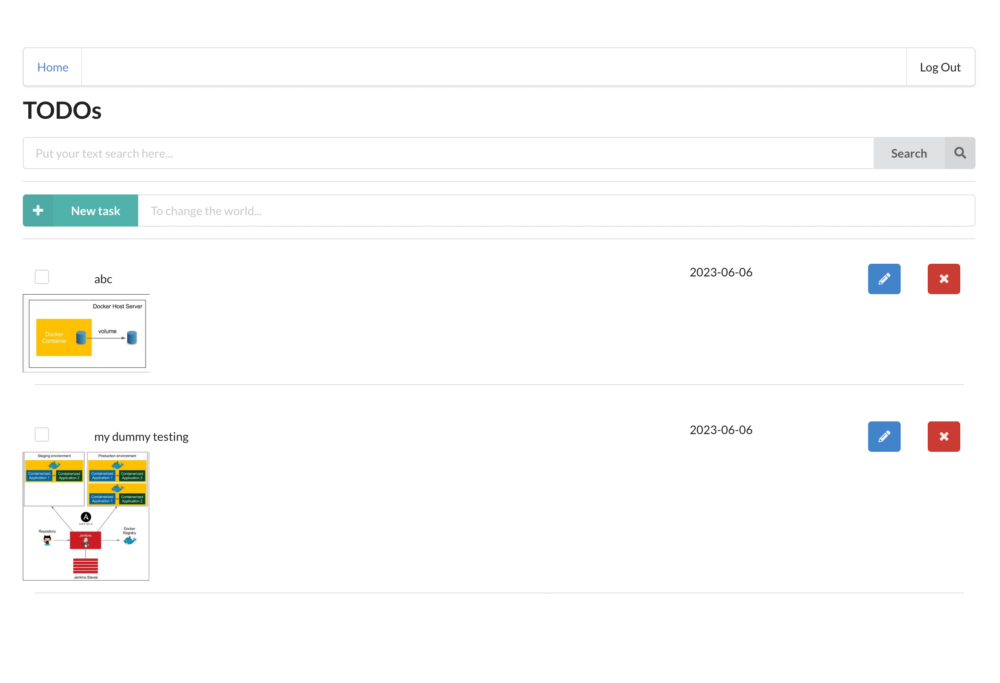

# Serverless TODO

To implement this project, you need to implement a simple TODO application using AWS Lambda and Serverless framework. Search for all comments starting with the `TODO:` in the code to find the placeholders that you need to implement.

# Integrate with ElasticSearch

I almost done to implment and integrate ElasticSearch to search full-text by todo name.

